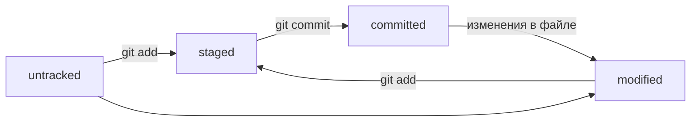

# 🧠 Шпаргалка по Git (продолжение)

## 📄 Жизненный цикл файлов в Git

**Состояния:**
- `untracked` — файл не отслеживается
- `modified` — файл изменён
- `staged` — изменения добавлены в индекс
- `committed` — изменения сохранены в истории

**Переходы:**
- `untracked` + `git add` → `staged`
- `modified` + `git add` → `staged`
- `staged` + `git commit` → `committed`
- `committed` + правки → `modified`

### 🧭 Mermaid-схема статусов



---

## 🧾 Стили сообщений к коммитам

**Зачем:** читаемость, порядок, автогенерация changelog'ов.

### 📌 Рекомендации

- Длина сообщения: **до 72 символов**
- Русский: **инфинитив**
  - `Добавить информацию о HEAD`
  - `Исправить ошибку в команде git log`
- Английский: **повелительное наклонение (imperative)**
  - `Fix bug`
  - `Add login page`

---

## ✨ Основные стили

### ✅ Conventional Commits

Формат: `<type>: <сообщение>`

**Типы:**
- `feat` — новая фича  
- `fix` — исправление  
- `docs`, `refactor`, `test`, `chore` — служебные

**Пример:**  
```bash
git commit -m "feat: добавить подсчёт заказов"
```

---

### ✅ Корпоративный стиль (Jira)

Формат: `PROJECT-XXX: Сообщение`

**Пример:**  
```bash
git commit -m "LGS-239: Обновить документацию"
```

---

### ✅ GitHub-стиль

Формат: `Сообщение с #<номер задачи>`

**Пример:**  
```bash
git commit -m "Исправить #334, обновить график"
```

GitHub автоматически свяжет коммит с issue.

---
